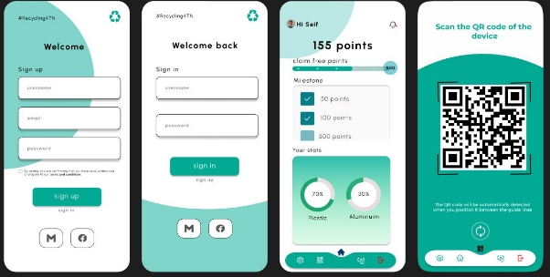

# Topic: Loyalty Application Report

**Executive Summary:**

In the present cutthroat market, little organizations are more aware of the fundamental job that client devotion plays in keeping up with advancement as well as guaranteeing long haul achievement. As rivalry warms up, organizations understand that building solid and long haul associations with their clients is basic to saving an upper hand. This expanded mindfulness underscores the requirement for original plans to further develop client commitment and dedication.

This study depicts the essential making of a reliability application using Android Studio, an innovation generally utilized for its flexibility and openness. The application has been purposely worked to go past value-based cooperations, determined to furnish clients with an extensive and redid experience. The unwaveringness application intends to fortify the connection between little organizations and their purchasers by advancing recurrent business with designated remunerates and giving a smoothed out interface. Besides, the reconciliation of Android Studio ensures that the improvement cycle sticks to industry principles, advancing adaptability and transformation in an always changing mechanical scene. This total technique endeavors to further develop client associations, yet in addition to improve corporate methodology for more noteworthy proficiency and viability.

**Introduction:**

Client faithfulness is a crucial determinant for the progress of private companies, assisting with supporting development and foster long haul associations with their clients. Perceiving this, the arranged dependability application is expected to be a critical instrument in creating and encouraging long haul associations. The app is well-positioned to take advantage of the widespread use of Android smartphones by making use of the capabilities of Android Studio. By doing so, it will strategically establish itself as a simple and easily accessible platform for consumer interaction.

The steadfastness application, planned with an accentuation on ease of use and smooth usefulness, means to give clients with a customized insight, upgrading their association with the organization. The application's direct highlights are intended to further develop both client maintenance and client joy. With Android Studio as the advancement stage, the application is strategically situated to benefit from the commonality and omnipresence of Android cell phones, permitting organizations to contact and draw in with their clients without any problem.

**Objectives:**

The creation of the loyalty app for small companies using Android Studio is directed by three main goals, each of which is designed to meet specific aspects of customer relationship management and operational efficiency.

1. **Enhancing Customer Retention:**

The essential objective is to fabricate and reinforce a dedicated client base with an exhaustive prizes and motivators program. Carrying out a focuses and remunerates framework will urge clients to make rehash buys, empowering dedication. The pseudo-code test underneath shows an improved on illustration of how the focuses framework might be carried out:

**pseudo**

function purchaseMade(amount):

pointsEarned = calculatePoints(amount)

customer.points += pointsEarned

updateCustomerPointsInDatabase(customer.id, customer.points)

This approach incentivizes customers to accumulate points with each transaction, creating a tangible and rewarding experience that fosters long-term relationships.

2. **Increasing Customer Engagement:**

By providing a dynamic and personalized platform for communication, special offers, and interactive content, the second objective is to increase customer engagement. The unwaveringness application will effectively connect with clients in the business' administrations by sending push alarms and unique limits. The pseudo-code test beneath represents a simple capability for conveying unique deal notices:

**pseudo**

function sendExclusiveOfferNotification(customerId):

offer = generateExclusiveOffer() sendNotification(customerId, "Exclusive Offer!", offer)

By utilizing such elements, the dedication application ensures that purchasers are persistently refreshed on extraordinary limits, customized offers, and other fascinating material, bringing about a more vivid and intuitive experience.

3. **Streamlining Operations:**

The third objective is to work on functional proficiency via consistently coordinating the devotion application with current frameworks to take into account more successful organization and information examination. The straightforward pseudo-code piece for handling versatile installments gives a delineation of this cooperation.

**pseudo**

function processMobilePayment(amount, customerId):

paymentService.processPayment(amount, customerId)

sendNotification(customerId, "Payment Successful! Earned Points: " + calculatePoints(amount))

This association ensures that the faithfulness application works flawlessly with installment frameworks, bringing about a more rearranged and straightforward experience for the two shoppers and organizations.

In synopsis, the objectives of faithfulness application improvement incorporate not simply laying out client dedication through a solid prizes framework, yet in addition further developing client commitment and streamlining functional strategies to guarantee long haul corporate achievement. The loyalty app aims to provide a comprehensive and efficient solution tailored to small business needs by addressing these critical areas.

**Key Features:**

1. **User-Friendly Interface:**

The app will feature an intuitive design, ensuring a seamless and enjoyable user experience.

2. **Points and Rewards System:**

**pseudo**

function purchaseMade(amount):

pointsEarned = calculatePoints(amount)

customer.points += pointsEarned

updateCustomerPointsInDatabase(customer.id, customer.points)

3. **Exclusive Offers and Discounts:**

pseudo

function sendExclusiveOfferNotification(customerId):

offer = generateExclusiveOffer()

sendNotification(customerId, "Exclusive Offer!", offer)

4. **Push Notifications:**

pseudo

function sendPushNotification(customerId, message):

pushNotificationService.send(customerId, message)

5. **Customer Data Analytics:**

pseudo

function analyzeCustomerData(customerId):

purchaseHistory = fetchPurchaseHistory(customerId) preferences = analyzePreferences(purchaseHistory) updateCustomerProfile(customerId, preferences)

6. **Membership Tiers:**

pseudo

function upgradeMembershipTier(customerId):

if customer.points >= GOLD\_TIER\_THRESHOLD:

customer.membershipTier = MembershipTier.GOLD sendNotification(customerId, "Congratulations! You are now a Gold Member.")

7. **Integration with Mobile Payments:**

pseudo

function processMobilePayment(amount, customerId):

paymentService.processPayment(amount, customerId)

sendNotification(customerId, "Payment Successful! Earned Points: " + calculatePoints(amount))

**Benefits:**

The creation and execution of a customized reliability application for little organizations utilizing Android Studio gives a few advantages that go past the quick capabilities.

As a matter of some importance, the reliability application is a viable driver for upgraded client maintenance. Organizations that have areas of strength for an and motivators framework can effectively invigorate rehash exchanges, laying out a feeling of reliability among their clients. This reinforces current client associations, yet it likewise impressively builds the whole revenue source. Clients are normally spurred to keep up with their relationship with an organization that perceives and remunerates their reliability, bringing about a mutually beneficial arrangement for the two sides.

Moreover, the dependability application is basic in driving customer commitment higher than ever. The arrangement of a customized and drawing in experience through special offers, limits, and custom-made content cultivates a more grounded connection between the organization and its buyers. The application fills in as an immediate course of contact, permitting organizations to communicate appreciation and worth to their buyers, further developing the whole client experience. In a period where individualized connections are profoundly valued, this commitment approach frames an establishment for long haul corporate achievement.

Another significant advantage of the loyalty app is its use of data-driven insights. Organizations might get huge experiences into client conduct, inclinations, and buy patterns

by utilizing examination abilities included inside the application. This plenty of information empowers firms to pursue taught choices, tweak advertising efforts, and further develop administrations to meet their clients' moving necessities and assumptions. The ability to extricate significant experiences from customer information gives firms an upper hand in the cutthroat scene.

Moreover, the dedication application assists with giving a novel upper hand on the lookout. In an undeniably educated client market, organizations that embrace current innovation and clever fixes stand apart from the opposition. The devotion application turns into an indication of development and client center, drawing in educated purchasers who esteem the simplicity and refinement of such frameworks. This upper hand draws new shoppers, however it likewise supports existing ones' faithfulness, as they regard the organization's devotion to remaining in front of industry patterns.

Finally, a loyalty app's advantages extend far beyond the transactional realm. It is a multi-layered device that advances rehash business as well as further develops client collaboration, conveys information driven bits of knowledge, and gives you an upper hand. Little organizations who utilize such a steadfastness program are better situated to make due as well as flourish in a dynamic and cutthroat business environment, growing long haul associations with their clients while remaining in front of the innovation bend.

**Implementation Plan:**

1. **Requirements Gathering:**

The progress of the reliability application is subject to an intensive comprehension of the business' special objectives, the qualities of the main interest group, and the elements that will increment commitment. This initial step involves carrying out broad groundwork, speaking with partners, and applying market bits of knowledge to decide the significant perspectives that will guarantee the steadfastness application meets as well as surpasses assumptions. The exploration interaction involves an intensive assessment of the business climate, including its labor and products, existing client base, and cutthroat scene. Investigating these perspectives permits the improvement group to recognize exceptional selling highlights and where an unwaveringness application might bring incredible worth. Stakeholder engagement becomes crucial during this phase, as it helps gather insights from key decision-makers, frontline staff, and, most importantly, the end-users. Through interviews, surveys, and workshops, the team can gain a nuanced understanding of business priorities and customer preferences.

In equal, market bits of knowledge have a significant impact in coming up with the faithfulness application's technique. Understanding business sector patterns, client ways of behaving, and impending innovation helps the application stay important and serious. This incorporates following adversary steadfastness programs, tracking down powerful highlights, and gaining from industry best practices. Furnished with an exhaustive comprehension of the business scene, the improvement group can interface the unwaveringness application's capabilities with the organization's essential objectives. For instance, assuming exploration shows that the ideal interest group lean towards customized encounters, the application could accentuate elements like customized ideas and designated promoting. This arrangement works on the application's viability, yet in addition guarantees that it turns into a vital part of the organization's more extensive development plan.

Moreover, the advancement group should keep up with adaptability and cycle over the course of this time. As new bits of knowledge arise and needs change, the group ought to be ready to likewise adjust the application's highlights and works. This versatile system keeps the unwaveringness application deft and delicate to the changing idea of the business climate. Lastly, thorough research and preparation are essential to the loyalty app's success. The improvement group lays the basis for a faithfulness application that fulfills prompt objectives as well as creates with the organization, supporting long haul achievement and client joy.

2. **Design and Development:**

Once the requirements have been properly gathered, the development phase begins with the usage of Android Studio, a powerful and adaptable platform known for producing complex and user-friendly mobile apps. Android Studio provides a broad range of tools and resources, allowing developers to harness the full potential of the Android operating system. Its integrated development environment (IDE) allows for the smooth integration of functionality, ensuring that the loyalty app works flawlessly across Android's varied variety of devices.

During the advancement stage, the plan cycle becomes the overwhelming focus, and it is a significant stage in making an engaging dedication application. The connection point made as of now centers visual appeal while additionally underscoring natural and client driven plan ideas. A joint exertion among creators and designers is expected to accomplish a sensitive harmony among feel and usefulness. This association ensures that the steadfastness application adheres to Android plan guidelines, yet additionally conveys a connecting with and superb client experience. Usefulness, simplicity of route, and stylish allure are the main elements all through this plan stage, with a solid accentuation on building a brought together and outwardly engaging point of interaction that interfaces with the target group.

As the plan develops, consideration is centered around guaranteeing that the steadfastness application interfaces easily with the Android climate. This involves intensive testing to guarantee similarity with various Android gadgets, screen sizes, and goals. Engineers make a solid effort to upgrade the application's speed while considering the different equipment specs found in the Android scene. Besides, the UI goes through iterative improvement to settle any conceivable ease of use concerns and lift by and large client bliss. Subsequently, the plan stage turns into a dynamic and iterative interaction, with nonstop input circles between the plan and improvement groups to calibrate the visual and useful elements of the unwaveringness application.

All in all, the Android Studio-fueled improvement stage not just takes utilization of the stage's mechanical capacities, yet additionally underscores the meaning of a cooperative and iterative methodology. The resultant reliability application looks for not exclusively to fulfill yet in addition to outperform client assumptions via consistently joining tasteful allure with strong usefulness in the Android climate.

3. **Testing:**

The dependability, security, and smooth client experience of the devotion application are basic to its prosperity. Extensive testing methods are carried out to identify and address any potential issues with the app before it is made available to the general public. This incorporates useful testing, a basic stage in which each component is entirely examined to guarantee that it capabilities as planned. Test situations are intended to cover an extensive variety of client cooperations, guaranteeing that shoppers can procure and recover devotion focuses, access remarkable offers, and explore the application easily. Any oddities or imperfections found during useful testing are rectified promptly to guarantee the application's general steadiness.

Security testing is one more significant part of the testing system. Given the significance of client information and exchange subtleties, the unwaveringness application goes through broad security testing. The group utilizes strategies like entrance testing to distinguish shortcomings that could endanger the application's security. Encryption measures, secure data storage, and authentication procedures are thoroughly examined to safeguard the app from cyberattacks. By putting security testing first, the improvement group desires to make trust in both the organization and its customers, cultivating a reliable climate for exchanges and cooperations inside the faithfulness application.

Convenience testing is fundamental for deciding the overall ease of use of a reliability application. This incorporates observing genuine clients as they draw in with the application, gathering criticism on their encounters, and recognizing regions for development. The UI, route stream, and openness highlights are completely tried to give a decent and natural client experience. By integrating client input into the advancement interaction, the group might work on the application's plan and usefulness, carrying it nearer to client assumptions. This iterative way to deal with ease of use testing assists with making a reliability application that fulfills industry prerequisites as well as surpasses client assumptions, bringing about expanded consumer loyalty and unwaveringness.

In rundown, the total testing procedure utilized all through the unwaveringness application's advancement incorporates practical testing to affirm usefulness, security testing to safeguard against digital dangers, and convenience testing to further develop generally client experience. By thoroughly fixing concerns detailed during testing, the improvement group is committed to creating a trustworthy, secure, and easy to use dependability application that creates certainty and reliability among its client base.

4. **Deployment:**

The deployment phase is a watershed moment in the project lifecycle because it signifies the app's official release to the public with a fully tested and optimized loyalty app. This stage is something other than making the application available for download; it's likewise an essential push focused on flawlessly incorporating the dependability program into clients' everyday existence. The cautious testing guarantees that the product isn't just utilitarian, yet additionally reliable and secure. Client input acquired all through the testing system has been basic in refining the application, settling any blemishes, and further developing the general client experience.

A careful showcasing exertion is being sent off related to the organization to construct energy and information about the new devotion program. This comprehensive strategy makes use of a variety of channels, such as in-store promotions, individualized email marketing, and social media platforms. The goal is to expand the application's openness and catch the consideration of the ideal crowd. Secret postings, intuitive material, and in the background looks all assistance to assemble energy via virtual entertainment stages. All the while, designated email crusades are shipped off existing clients, underlining the advantages of the dedication application and giving exceptional motivators to early clients. In-store advancements, for example, signage and staff association, help to build up the message, guaranteeing that clients are mindful of the steadfastness program as well as anxious to join.

Clear and compelling correspondence is basic during the organization stage. Definite publicizing materials, both computerized and physical, frame the application's capacities, benefits, and how it upgrades the shopper experience. The app's ease of use, tangible incentives, and seamless integration with everyday activities pique users' interest and enthusiasm. The loyalty app has transformed from a purely technological product into a crucial tool for enhancing customers' connections with the business thanks to this marketing strategy, which is crucial in promoting widespread adoption among customers.

5. **Monitoring and Updates:**

The starting of the reliability application doesn't flag the finish of the improvement interaction; rather, it flags the beginning of a nonstop pattern of progress. The observing and refreshes stage involves effectively checking application execution, gathering client input, and investigating information to find regions for upgrades. Standard updates are delivered to tackle bugs, offer new elements, or further develop existing ones relying upon client conduct and inclinations. This constant methodology keeps the unwaveringness application refreshed, serious, and in accordance with changing organization requests and purchaser assumptions.

In rundown, the execution system adopts a trained and iterative strategy that incorporates all that from understanding business needs to constant update in light of client input. This exhaustive interaction tries to foster a faithfulness application that satisfies the business' quick necessities, yet additionally develops over the long haul to stay important and persuasive.

**Conclusion:**

The improvement of a prize application appropriate for little organizations utilizing Android Studio is a basic move toward changing customer collaborations and reinforcing brand devotion. In a period where innovation leap forwards are reclassifying client assumptions, little organizations should embrace effective fixes to get by as well as flourish in a serious commercial center. This loyalty app's deliberate development serves as a beacon, pointing small businesses in the direction of a future in which customer connections are not just transactional but also infused with personalized, satisfying experiences.

Consolidating innovation, particularly through the Android Studio stage, permits little organizations to draw in with their shoppers on a more profound way. The easy to use UI ensures that clients, paying little heed to specialized capacity, can undoubtedly use the application, advancing a feeling of openness and consideration. The improvement of a solid Places and Rewards Framework, as found in the pseudo-code scraps, switches normal exchanges into opportunities for shoppers over completely to procure focuses and access exceptional advantages. This powerful commitment system is basic for expanding client maintenance, which is a critical part of long haul business achievement.

Moreover, the application's capacity to convey Pop-up messages and give Restrictive Offers and Limits makes an immediate channel of correspondence with clients. Opportune and customized cautions keep clients informed about specials, however they likewise act as a method for offering thanks. The pseudocode models show how these functionalities might be easily coordinated, bringing about a dynamic and responsive devotion application that reaches out past conditional connections. This modified touch is vital for building profound binds with clients, a part that is some of the time ignored in conventional business techniques.

The mix of Client Information Examination, as found in the pseudo-code pieces, shows the application's ability to change crude information into significant bits of knowledge. Understanding customer inclinations and conduct empowers little firms to change their administrations to individual necessities, bringing about a commonly gainful organization. This information driven technique further develops client bliss as well as takes into consideration more educated business choices, for example, smoothing out activities and promoting drives.

To sum up, fostering a devotion application for little organizations utilizing Android Studio is more than just a mechanical development; it is an essential interest in store for client associations. Private companies who utilize this exceptional methodology might make a drawn out impact on their purchaser base, building devotion that goes past individual buys. With its user-centric design and extensive functions, this loyalty app helps small businesses succeed in a market that is changing quickly and where personalized experiences and customer involvement are essential to long-term success.

14
